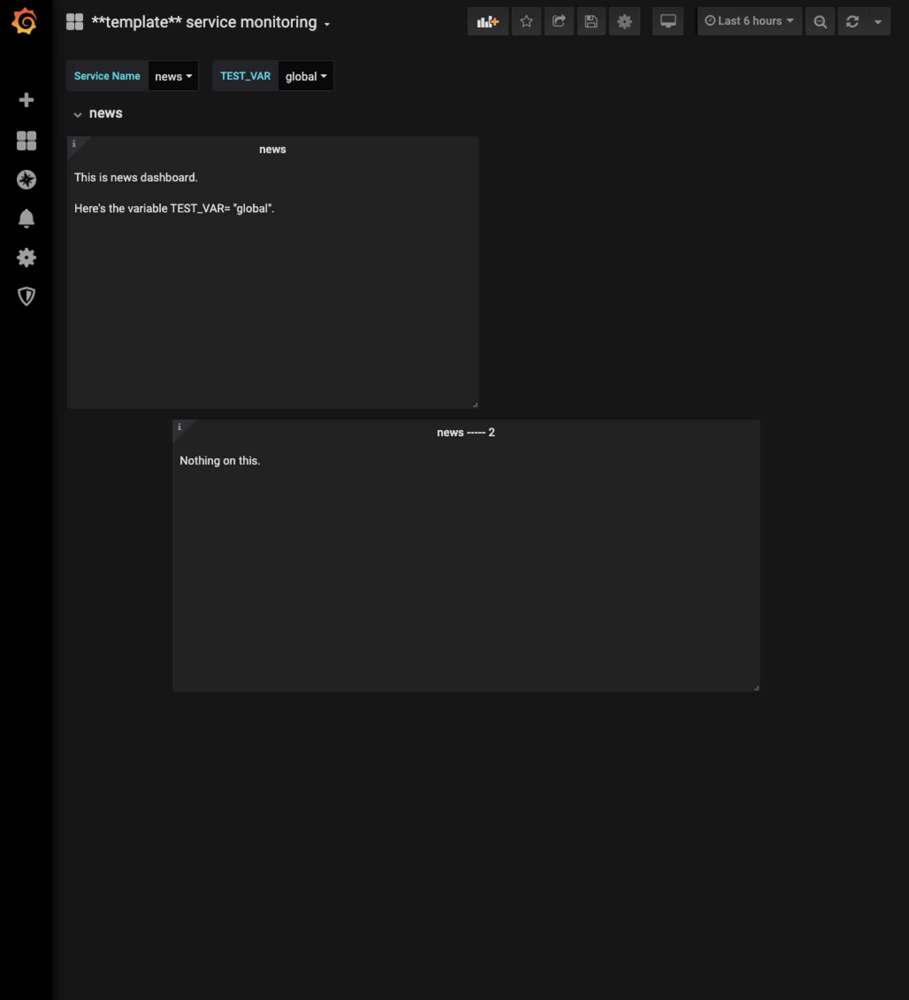

# Grafana operator
This tool is used to render the Grafana dashboard with predefined variables statically. (supports Grafana v6+)

## Why do I develop this?
Grafana dashboard supports [template variables](https://grafana.com/docs/grafana/latest/reference/templating/),
which will improve the expression, user can easily use predefined variables to render the dashboard dynamically,
not only the queries including these variables can be rendered, but also the panels can be repeated by variable.
This reduces a lot of toils to create multiple similar graphs which only differ in some arguments.

**But the Grafana alerts can't be supported when using template variables**, you might use alertmanager or other approaches to implement. 

## QuickStart
1. define a template dashboard in Grafana  
A template dashboard is the same as a dashboard with template variables, define the variables you will customize later.
1. create the configuration for rendering variables  
The format is in yaml file, for example you defined `SERVICE_NAME` and `TEST_VAR` as variables, you need to set the values they
might have, in this case, `news`, `payment`, `user`.  
The context accompanied with the value is that when one value is specified, which context in that panel should use, this
can be the case when you need to setup the `TEST_VAR` to `local_payment` in that panel when `SERVICE_NAME` is `payment`.
 
    ```yaml
    ---
    vars:
      -
        name: SERVICE_NAME
        values:
          -
            context:
              TEST_VAR: local_news
            value: news
          -
            context:
              TEST_VAR: local_payment
            value: payment
          -
            context: ~
            value: user
      -
        name: TEST_VAR
        values:
          -
            context: ~
            value: global
    ```

1. Render it!
The following command will call the Grafana API to render the template dashboard and finally create another rendered dashboard.
    ```bash
    go run cmd/grafops/grafops.go --host http://localhost:3000 -u RKAQZi9Zk --basic_auth $GRAFANA_USERNAME:$GRAFANA_PASSWORD -c ./config.yaml
    ```

## Installation
```bash
go build -o grafops cmd/grafops/grafops.go
mv grafops /usr/local/bin
```

## Local Test
This introduces how to render the test dashboard on your local machine.

1. Run Grafana
Use docker to run Grafana dashboard in your local environment.
    ```bash
    docker run -p 3000:3000 grafana/grafana:6.5.0
    ```

1. Import Grafana test dashboard
Access http://localhost:3000/dashboard/import and paste the `samples/grafana_test_dashboard.json` to the dashboard content.



1. Provision an API Key in Grafana
Access http://localhost:3000/org/apikeys to create an editor/admin API key.

1. Render the dashboard
    ```bash
    go run cmd/grafops/grafops.go --host http://localhost:3000 -t template-service-monitoring --basic_auth <auth-key>
    ```
   
   There will be a rendered dashboard created.
   
   
